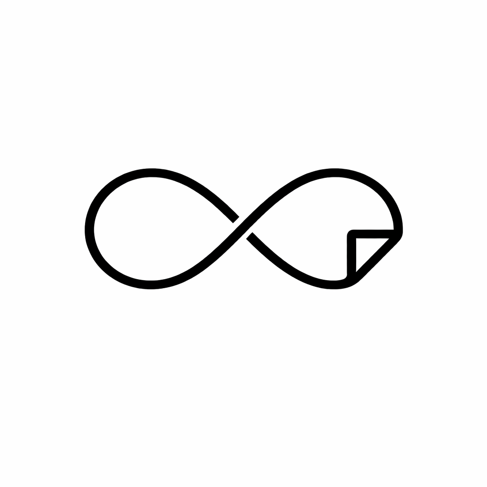

<div align="center">
  

  <h1>Infinito</h1>

  <p><strong>A minimalist note-taking app with an infinite canvas</strong></p>

  <p>
    <em>Write. Draw. Think without limits.</em>
  </p>

  <p>
    <a href="https://electronjs.org">
      
    </a>
    <a href="https://react.dev">
      
    </a>
    <a href="https://www.typescriptlang.org">
      
    </a>
    <a href="https://bun.sh">
      
    </a>
    <a href="https://codecov.io/gh/blas-works/infinito">
      
    </a>
  </p>

  <p>
    <a href="#features">Features</a> •
    <a href="#installation">Installation</a> •
    <a href="#development">Development</a>
  </p>
</div>

---

## Features

| **Notes**    | Infinite canvas with pan and zoom               |
| :----------- | :---------------------------------------------- |
|              | Markdown support with syntax highlighting       |
|              | Mermaid diagram rendering in code blocks        |
|              | Date-based organization with collapsible groups |
| **Canvas**   | Shape tools: rectangles, circles, triangles     |
|              | Lines and arrows with Bezier curves             |
|              | Text elements with customizable font            |
|              | Color presets and line styles (solid/dash/dot)  |
| **Settings** | Configurable font size and family               |
|              | Syntax theme selection                          |
| **Data**     | Local SQLite storage, no cloud required         |
|              | Offline-first design, privacy-focused           |

## Installation

### Homebrew

**Step 1:** Add the tap (first time only):

```bash
brew tap blas-works/apps
```

**Step 2:** Install:

```bash
brew install --cask hollow
brew install --cask infinito
```

Or install without prior tap:

```bash
brew install --cask blas-works/apps/hollow
brew install --cask blas-works/apps/infinito
```

**Update** (when a new version is released):

```bash
brew upgrade --cask hollow
brew upgrade --cask infinito
```

**Option 2** — One-liner without prior tap:

```bash
brew install --cask blas-works/apps/hollow
brew install --cask blas-works/apps/infinito
```

### Manual Download

Download the latest version from [GitHub Releases](https://github.com/blas-works/infinito/releases/latest).

| Platform    | Architecture  | Format                    |
| ----------- | ------------- | ------------------------- |
| **Windows** | x64           | `.exe` (NSIS)             |
| **Linux**   | x64           | `.AppImage` `.deb` `.rpm` |
| **macOS**   | Apple Silicon | `.dmg`                    |
| **macOS**   | Intel         | `.dmg`                    |

#### macOS: First Run

The app is not signed with Apple Developer. After installing, run in Terminal:

```bash
xattr -cr /Applications/Infinito.app
```

> **Note:** Automatic updates are not available on macOS (requires Apple Developer signature). Download new versions manually from [Releases](https://github.com/blas-works/infinito/releases/latest).

## Development

### Prerequisites

- **Node.js** >= 18.x
- **Bun** >= 1.0

### Quick Start

```bash
# Clone the repository
git clone https://github.com/blas-works/infinito.git
cd infinito

# Install dependencies
bun install

# Run in development mode
bun run dev
```

<details>
<summary><b>Development Scripts</b></summary>

| Command                 | Description                        |
| ----------------------- | ---------------------------------- |
| `bun run dev`           | Development server with hot reload |
| `bun run build`         | Production build (auto-detects OS) |
| `bun run build:win`     | Build for Windows (.exe)           |
| `bun run build:mac`     | Build for macOS (.dmg)             |
| `bun run build:linux`   | Build for Linux (.AppImage, .deb)  |
| `bun run test`          | Run tests in watch mode            |
| `bun run test:run`      | Run tests once                     |
| `bun run test:coverage` | Run tests with coverage report     |

</details>

---

<div align="center">
  <sub>Made with ❤️ by <a href="https://github.com/blas-works">blas-works</a></sub>
</div>
